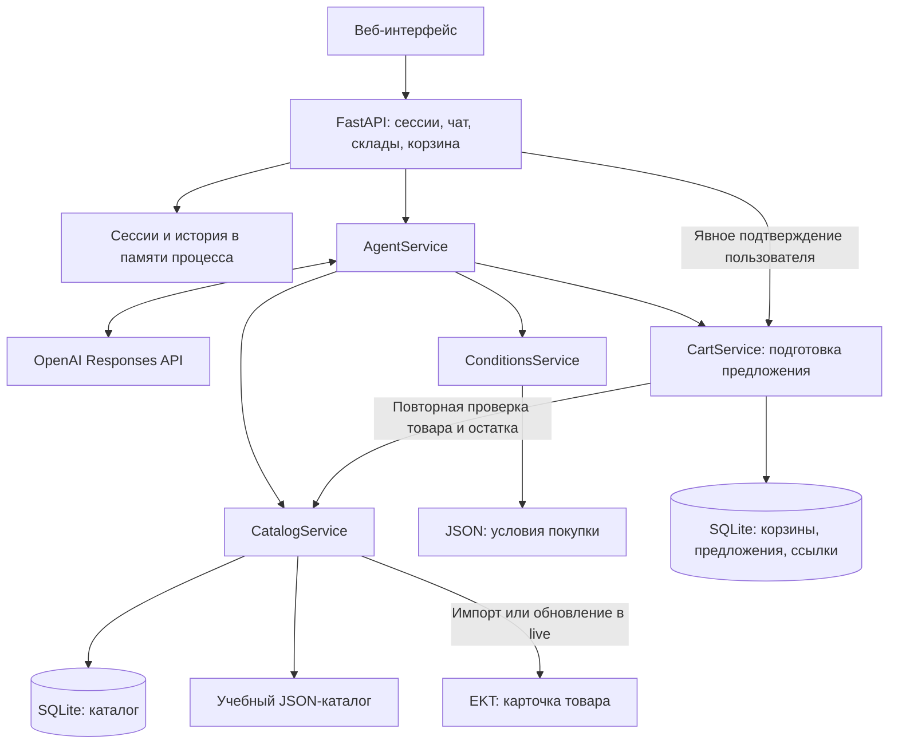

# EKT AI — AI-консультант по каталогу электротоваров

EKT AI — прототип консультанта для покупателей и специалистов по закупкам электротоваров. Он объединяет в одном диалоге поиск товара, просмотр характеристик, проверку складского остатка, подбор кандидатов на замену и подготовку корзины. Пользователь может пройти от текстового запроса до подтверждённого добавления товара в демонстрационную корзину.

**Текущая версия:** веб-интерфейс, Python API и агент на OpenAI Responses API. По умолчанию используются три учебных товара. Для обычного диалога нужен ключ OpenAI даже в демонстрационном режиме. Корзина хранится локально и не создаёт заказ в EKT.

## Что реализовано

- **Диалоговый интерфейс:** выбор склада, история сообщений в текущей сессии, карточки товаров с характеристиками, ценой, источником данных и доступными ссылками на сертификаты.
- **Поиск по доступному каталогу:** по артикулу или названию, с фильтрами категории, бренда и поддерживаемых характеристик. Поиск работает по локально загруженной выборке.
- **Проверка товара и остатка:** цена, единица продажи, кратность и доступность на выбранном складе. Неизвестный остаток отличается от нулевого.
- **Подбор аналогов по правилам:** для категории `demo_breaker` сравниваются число полюсов, номинальный ток, характеристика срабатывания и отключающая способность; учитываются склад и положительный остаток. Результат содержит совпадения, различия и ограничения.
- **Справочная информация:** ссылки на сертификаты из данных товара, условия оплаты, доставки и минимальной партии из локальных файлов.
- **Добавление с подтверждением:** сначала сервер готовит предложение с ценой, количеством, суммой и сроком действия. Пользователь отдельно подтверждает его. При подтверждении сервер повторно проверяет условия и остаток.
- **Демонстрационная корзина:** расчёт суммы в KZT, сохранение в SQLite и временная ссылка только для просмотра. Повторное подтверждение того же предложения не добавляет товар второй раз.
- **Два режима данных:** `fixture` для учебного набора и `live` для ограниченного импорта карточек EKT. Данные режимов хранятся отдельно.

## Как работает решение

1. При открытии страницы браузер создаёт сессию через API и получает список доступных складов.
2. Пользователь выбирает склад и вводит запрос, например: «Найди DEMO-001, покажи характеристики и остаток».
3. Агент передаёт запрос модели OpenAI. Модель может вызвать один из восьми разрешённых инструментов: список складов, поиск, карточка товара, остаток, аналоги, сертификаты, условия покупки или подготовка добавления.
4. Сервер проверяет аргументы инструментов и обращается к сервисам каталога, условий и корзины. Интерфейс получает текст ответа и структурированные данные.
5. По запросу «Добавь 2 штуки DEMO-001» сервер проверяет товар и готовит предложение. На этом этапе состав корзины ещё не меняется.
6. Пользователь нажимает **«Подтвердить добавление»**. Сервер проверяет срок действия предложения, цену, единицу и шаг продажи, допустимость склада и остаток с учётом уже добавленного количества.
7. При успешной проверке товар сохраняется в локальной корзине; интерфейс показывает позиции, итоговую сумму и ссылку просмотра.

Модель не получает инструмент подтверждения. Альтернативное подтверждение через чат требует одновременно идентификатор предложения и одну из точных фраз: `да, добавь`, `да добавь` или `подтверждаю добавление`. Обычное «да» не подтверждает действие.

## Технологии

| Компонент | Технологии и назначение |
| --- | --- |
| Backend | Python; FastAPI `0.115.0`, Uvicorn `0.30.6` — HTTP API и раздача интерфейса |
| Контракты данных | Pydantic `2.13.5` — строгая валидация запросов, результатов и аргументов инструментов |
| AI | OpenAI Python SDK `1.109.1`, Responses API и вызов инструментов; модель задаётся через `OPENAI_MODEL` |
| HTTP-интеграция | HTTPX `0.27.2` — запросы к карточкам товаров EKT |
| Хранилище | SQLite через стандартный модуль `sqlite3`; JSON-файлы с исходными учебными данными и условиями |
| Интерфейс | HTML, CSS, JavaScript без отдельного фреймворка и этапа сборки |
| Расчёты и асинхронность | Стандартные модули Python `decimal` и `asyncio` |
| Тестирование | pytest `8.3.3`, pytest-asyncio `0.24.0`, HTTPX ASGITransport и MockTransport |

Версии закреплены в [requirements.txt](backend/requirements.txt) и [requirements-dev.txt](backend/requirements-dev.txt). В [настройках](backend/app/config.py) и [.env.example](backend/.env.example) модель по умолчанию указана как `gpt-5.6-luna`. Это значение конфигурации репозитория; доступ к выбранной модели в аккаунте OpenAI нужно обеспечить отдельно.

## Архитектура проекта



```text
.
├── backend/
│   ├── app/
│   │   ├── main.py           # Запуск приложения, сервисы, API и статика
│   │   ├── config.py         # Переменные окружения и пути к данным
│   │   ├── contracts.py      # Общие модели данных и интерфейсы сервисов
│   │   ├── sessions.py       # Сессии, история и блокировки запросов
│   │   ├── api/              # HTTP-маршруты
│   │   ├── agent/            # Responses API и реестр инструментов
│   │   ├── catalog/          # Поиск, нормализация, fixture/live, SQLite
│   │   ├── conditions/       # Чтение условий покупки
│   │   └── cart/             # Предложения, подтверждение и просмотр корзины
│   ├── data/                # Каталог, условия и учебный сертификат
│   ├── scripts/             # Ограниченный импорт карточек EKT
│   ├── tests/               # Тесты компонентов, API и сквозного сценария
│   ├── .env.example
│   ├── requirements.txt
│   └── requirements-dev.txt
└── web/
    ├── index.html
    └── assets/              # JavaScript и CSS
```

FastAPI раздаёт интерфейс и API с одного адреса. Каталог и корзина используют отдельные SQLite-файлы в `EKT_DATA_DIR/<режим>/`. Сессии, история диалога и выбранные товар и склад находятся в памяти процесса, поэтому приложение нужно запускать **с одним worker**.

Основные маршруты:

| Метод и путь | Назначение |
| --- | --- |
| `GET /` | Веб-интерфейс |
| `GET /health` | Статус процесса и режим каталога |
| `POST /api/v1/sessions` | Создание сессии и выдача токена |
| `GET /api/v1/warehouses` | Список складов |
| `POST /api/v1/chat` | Диалог с агентом |
| `GET /api/v1/cart` | Текущая корзина |
| `POST /api/v1/cart/actions/{action_id}/confirm` | Подтверждение предложения |
| `GET /cart/view/{view_token}` | HTML-представление корзины по временной ссылке |
| `GET /demo-certificates/DEMO-CERT-001.html` | Учебный документ |

API складов, чата, корзины и подтверждения требует `Authorization: Bearer <session_token>`. Ссылка просмотра открывается без этого заголовка: доступ даёт токен в самой ссылке.

## Установка и запуск

### 1. Подготовить окружение

Нужны Python **3.11 или новее** (код использует `asyncio.timeout`), `pip` и возможность создать виртуальное окружение. Для установки пакетов и работы чата требуется доступ в интернет. Команды ниже рассчитаны на Bash в Linux/macOS.

Если репозиторий ещё не скачан:

```bash
git clone https://github.com/BAITC-Hacks/hack-84dbe8eb-sherkhandev.git
cd hack-84dbe8eb-sherkhandev
```

Из корня репозитория:

```bash
cd backend
python3 -m venv .venv
source .venv/bin/activate
python -m pip install -r requirements.txt -r requirements-dev.txt
```

Node.js, отдельный сервер базы данных и сборка frontend не требуются. SQLite-файлы создаются при запуске приложения.

### 2. Задать настройки

Приложение **не загружает `.env` автоматически**. Настройки нужно передать через окружение процесса. Для загрузки значений из поставляемого примера выполните из `backend/`:

```bash
set -a
source .env.example
set +a
```

Для полноценного диалога задайте ключ OpenAI. Следующая команда запрашивает его без отображения на экране:

```bash
read -r -s -p 'OPENAI_API_KEY: ' OPENAI_API_KEY
printf '\n'
export OPENAI_API_KEY
```

При необходимости измените `OPENAI_MODEL` на доступную вашему аккаунту модель с поддержкой Responses API и вызова инструментов.

Для live-режима задайте Basic Auth EKT и используйте тот же каталог данных при импорте и запуске:

```bash
export CATALOG_MODE=live
export EKT_DATA_DIR=/tmp/ekt-ai-live
export EKT_API_USERNAME='логин из защищённого окружения'
export EKT_API_PASSWORD='пароль из защищённого окружения'
python -m scripts.import_catalog --product-id 515291
```

Импорт можно повторять для других ID товаров, передавая несколько `--product-id` (не более 20 за один запуск).

| Переменная | Значение по умолчанию | Назначение |
| --- | --- | --- |
| `OPENAI_API_KEY` | Не задано | Ключ для работы чата; в `.env.example` отсутствует |
| `OPENAI_MODEL` | `gpt-5.6-luna` | Имя модели для Responses API |
| `CATALOG_MODE` | `fixture` | `fixture` — учебные данные, `live` — данные адаптера EKT |
| `APP_BASE_URL` | `http://127.0.0.1:8000` | Основа ссылок просмотра корзины |
| `EKT_DATA_DIR` | `/tmp/ekt-ai` | Каталог SQLite-файлов; для постоянного хранения задайте другой доступный путь |
| `ACTION_TTL_SECONDS` | `300` | Срок действия предложения на добавление, в секундах |
| `VIEW_TTL_SECONDS` | `1800` | Срок действия ссылки просмотра, в секундах |
| `LLM_TIMEOUT_SECONDS` | `30` | Общий таймаут обработки обращения к модели |
| `EKT_TIMEOUT_SECONDS` | `10` | Таймаут HTTP-клиента EKT |
| `EKT_API_USERNAME` | Не задано | Логин Basic Auth для live API EKT |
| `EKT_API_PASSWORD` | Не задано | Пароль Basic Auth для live API EKT |

### 3. Запустить приложение

Из `backend/`, с активированным окружением:

```bash
python -m uvicorn app.main:app --host 127.0.0.1 --port 8000 --workers 1 --no-access-log
```

- Интерфейс: [http://127.0.0.1:8000/](http://127.0.0.1:8000/).
- Документация API: [http://127.0.0.1:8000/docs](http://127.0.0.1:8000/docs).
- Проверка процесса: [http://127.0.0.1:8000/health](http://127.0.0.1:8000/health).

`--no-access-log` отключает журнал URL-запросов, в который могли бы попасть токены ссылок просмотра. При смене адреса или порта задайте соответствующий `APP_BASE_URL`.

**Без ключа OpenAI** сервер и интерфейс запускаются, сессии, список складов и API корзины доступны, но обычный запрос в чат возвращает HTTP `503` с кодом `LLM_UNAVAILABLE`. Режим `fixture` подменяет данные магазина, а не ответы модели. `/health` не проверяет доступность OpenAI или EKT.

## Как проверить решение

### Автоматические проверки без внешних сервисов

Из `backend/`, после установки зависимостей:

```bash
test_data_dir=$(mktemp -d)
OPENAI_API_KEY= CATALOG_MODE=fixture EKT_DATA_DIR="$test_data_dir" python -m pytest -q
```

Отдельная проверка сквозного сценария:

```bash
test_data_dir=$(mktemp -d)
OPENAI_API_KEY= CATALOG_MODE=fixture EKT_DATA_DIR="$test_data_dir" python -m pytest tests/integration -q
```

Тесты охватывают контракты, сессии и API, инструменты агента, каталог и условия, подготовку и подтверждение корзины, сроки действия и конкурентные подтверждения. В [сквозном тесте](backend/tests/integration/test_full_flow.py) проверяются добавление двух DEMO-001, итог `2400.00`, отсутствие повторного добавления при повторном подтверждении и открытие ссылки просмотра.


## Данные и интеграции

### Учебный каталог — `CATALOG_MODE=fixture`

Источник — [backend/data/catalog/fixture.json](backend/data/catalog/fixture.json). При старте он загружается в локальную SQLite-базу. Для чтения этих данных запросы в EKT не выполняются.

| Артикул / внутренний ID | Название | Цена, KZT | Остаток на учебном складе | Назначение |
| --- | --- | --- | --- | --- |
| `DEMO-001` / `demo-001` | Учебный автомат A | 1200.00 | 5 | Основной сценарий корзины; есть учебный сертификат |
| `DEMO-002` / `demo-002` | Учебный автомат B | 1300.00 | 0 | Демонстрация отсутствующего товара |
| `DEMO-003` / `demo-003` | Учебный автомат C | 1500.00 | 10 | Учебный кандидат на замену DEMO-002 |

Все товары синтетические. Условия находятся в [data/conditions/fixture](backend/data/conditions/fixture), сертификат — в [data/certificates](backend/data/certificates). Они не подтверждают реальные цены, остатки, условия или сертификацию EKT.

### Адаптер EKT — `CATALOG_MODE=live`

В [live-адаптере](backend/app/catalog/live.py) реализован запрос `GET https://ekt.kz/api/products/detail?id=<product_id>`. Сервис сохраняет исходный JSON и нормализованные сведения о товаре и складах. Неизвестные числовые значения остаются `null`.

Live API EKT требует Basic Auth. Логин и пароль передаются только через `EKT_API_USERNAME` и `EKT_API_PASSWORD`; значения не должны добавляться в репозиторий или `.env.example`.

**Полный каталог автоматически не загружается.** Поиск работает только по уже импортированным карточкам. Для явного импорта предусмотрен [scripts/import_catalog.py](backend/scripts/import_catalog.py), максимум 20 идентификаторов за один запуск.

Пример из `backend/` — замените `<реальный_ID_товара_EKT>` на известный вам идентификатор:

```bash
export CATALOG_MODE=live
python -m scripts.import_catalog --product-id '<реальный_ID_товара_EKT>'
python -m uvicorn app.main:app --host 127.0.0.1 --port 8000 --workers 1 --no-access-log
```

Параметр `--product-id` можно повторять. Импорт и сервер должны использовать одинаковый `EKT_DATA_DIR`. Live-подключение проверено на 40 предоставленных ID: импортированы 40 товаров, 24 склада и 708 складских записей. При ошибке свежего запроса сервис возвращает `SOURCE_UNAVAILABLE`, не выдавая старый снимок за свежий.

Файлы [data/conditions/live](backend/data/conditions/live) содержат `status: "unknown"`: подтверждённых условий оплаты, доставки и минимальной партии для live-режима сейчас нет. Автоматического получения этих условий не реализовано. Для возврата к учебному сценарию перезапустите сервер с `CATALOG_MODE=fixture`.

### OpenAI

Модель получает пользовательские сообщения, последние 12 сообщений истории, контекст выбранного товара и склада и результаты вызванных инструментов. Это внешний API, необходимый для обычного чата в обоих режимах каталога. Токены сессии и ссылки просмотра корзины исключаются из структурированных данных для модели; в тексте маскируются Bearer-токены и ссылки `/cart/view/`.

## Ограничения текущей версии

- **Корзина всегда демонстрационная**, включая `live`. Оформления реального заказа, оплаты, резервирования остатков и изменения корзины EKT нет.
- Каталог — ограниченная локальная выборка. Полного импорта и автоматической синхронизации каталога нет; карточки добавляются явным импортом по ID.
- Правила аналогов поддерживают только категорию `demo_breaker` и четыре заданные характеристики. Совпадение учебных параметров не подтверждает реальную взаимозаменяемость оборудования.
- Добавление поддерживает только штуки (`pcs`), целое положительное количество и целый шаг продажи. API удаления позиций и изменения количества уже добавленных строк нет.
- Сессии и история не сохраняются между перезапусками сервера. Браузер хранит токен только в памяти вкладки, поэтому после обновления страницы создаётся новая сессия. SQLite-записи корзин сохраняются, но восстановления прежней сессии в интерфейсе нет.
- Нет пользовательских аккаунтов и механизма автоматического истечения сессий. История накапливается в памяти, хотя модели передаются только последние 12 сообщений. Несколько worker-процессов текущей схемой сессий не поддерживаются.
- Чат зависит от внешней модели, ключа и сети; локального запасного режима ответов нет. На один запрос предусмотрено не более четырёх раундов обращения к модели.
- Карточки и суммы берутся из сервисов, но свободный текст ответа модели не проходит отдельную проверку достоверности каждого утверждения.
- Загрузка и разбор Excel, Word, PDF и изображений не реализованы. Учебный сертификат предоставляется как готовая HTML-страница.

## Развёрнутая версия

Публичная ссылка на развёрнутую версию в текущем репозитории не указана. В текущей среде live-сервер доступен локально: [http://127.0.0.1:8000/](http://127.0.0.1:8000/). Для AI-чата дополнительно нужен `OPENAI_API_KEY`; SDK установлен в локальном виртуальном окружении `backend/.venv`.
