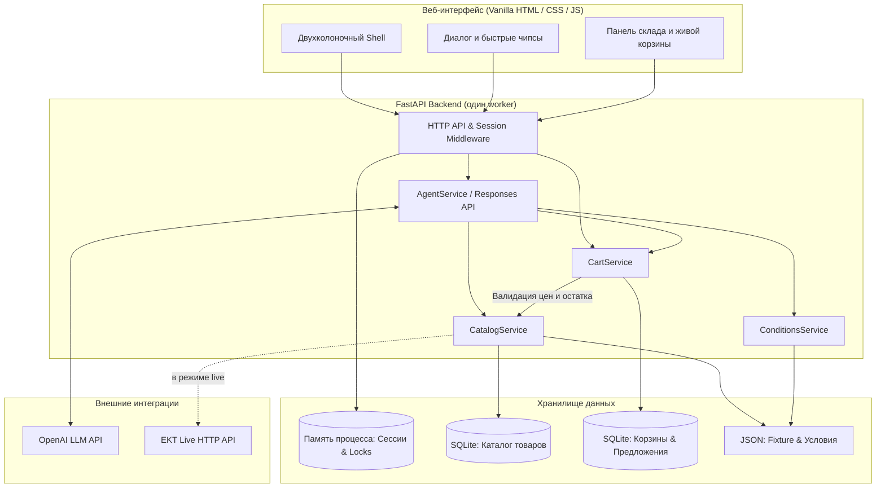

# EKT AI — Интеллектуальный B2B-консультант по каталогу электротоваров

<div align="center">


**Интеллектуальная система подбора электротехнической продукции, проверки складских остатков в реальном времени и безопасного формирования заказа.**

[Быстрый старт](#-быстрый-старт-за-1-минуту) • [Демо-сценарии](#-сценарии-демонстрации-для-жюри) • [Архитектура](#-архитектура-решения) • [Веб-интерфейс](#-новый-веб-интерфейс) • [Тестирование](#-тестирование-и-верификация)

---

</div>

## 📌 О проекте

**EKT AI** — это прототип специализированного AI-консультанта для специалистов по закупкам, электриков и инженеров. Сервис объединяет в одном окне:
1. **Умный диалог**: поиск по артикулу, названию и техническим параметрам.
2. **Точную валидацию остатков**: различия между отсутствием на складе и неизвестным остатком, проверка кратности и шага отгрузки.
3. **Алгоритмический подбор аналогов**: техническое сопоставление номиналов, характеристик срабатывания и отключающей способности.
4. **Безопасное добавление в корзину (Two-Phase Commit)**: подготовка проверяемого сервером предложения (*Pending Action*) с таймером действия и явное подтверждение пользователем.
5. **Защищённый просмотр заказа**: генерация временной ссылки только для чтения (`read-only token`) без передачи секретных токенов сессии.

---

## ⚡ Быстрый старт за 1 минуту

### 1. Клонирование и виртуальное окружение
```bash
cd backend
python3 -m venv .venv
source .venv/bin/activate
pip install -r requirements.txt -r requirements-dev.txt
```

### 2. Запуск в учебном режиме (Fixture)
Учебный режим работает **автономно** с локальной SQLite-базой и демонстрационным каталогом:

```bash
# Применение базовых настроек
set -a && source .env.example && set +a

# (Опционально) Установка ключа OpenAI для живого чата с моделью:
export OPENAI_API_KEY="sk-..."

# Запуск FastAPI сервера (один worker для SessionStore в памяти процесса)
python -m uvicorn app.main:app --host 127.0.0.1 --port 8000 --workers 1 --no-access-log
```

- 🌐 **Интерфейс**: [http://127.0.0.1:8000/](http://127.0.0.1:8000/)
- 📖 **Swagger API Docs**: [http://127.0.0.1:8000/docs](http://127.0.0.1:8000/docs)
- 🩺 **Healthcheck**: [http://127.0.0.1:8000/health](http://127.0.0.1:8000/health)

> [!NOTE]
> Без ключа OpenAI интерфейс, выбор складов и API корзины полноценно работают. При прямом запросе в чат возвращается HTTP `503 LLM_UNAVAILABLE`, что позволяет проверить доступность всех сервисов бэкенда без сторонних ключей.

---

## 🖥️ Новый веб-интерфейс

Интерфейс спроектирован по стандартам современных корпоративных рабочих пространств (B2B Copilot):

```
┌────────────────────────────────────────────────────────────────────────┐
│  ⚡ EKT AI [B2B Copilot]                  ● Live-каталог подключён      │
├─────────────────────────────────────────┬──────────────────────────────┤
│ 💬 ЧАТ-КОНСУЛЬТАНТ                      │ 🏬 РАБОЧИЙ СКЛАД             │
│                                         │ [ Учебный склад          ▼ ] │
│  ✦ Здравствуйте! Чем могу помочь?       │                              │
│  👤 DEMO-001, 2 шт.                     ├──────────────────────────────┤
│  ✦ AI обрабатывает запрос... ● ● ●      │ 🛒 КОРЗИНА ЗАКАЗА        [1] │
│                                         │ • DEMO-001 (2 шт.)  2 400 ₸  │
│  ┌───────────────────────────────────┐  │ ──────────────────────────── │
│  │ ⚡ Карточка подтверждения         │  │ Итого к оплате:     2 400 ₸  │
│  │ [✓ Подтвердить добавление]        │  │ [Открыть ссылку просмотра ↗] │
│  └───────────────────────────────────┘  │                              │
│                                         ├──────────────────────────────┤
│ [🛒 DEMO-001] [🔍 Поиск] [⚡ Аналоги]   │ 💡 ПАМЯТКА                   │
│ ┌───────────────────────────┬─────────┐ │ • Двухэтапное подтверждение  │
│ │ Введите артикул или вопрос│Отправить│ │ • Валидация остатков в реальном│
│ └───────────────────────────┴─────────┘ │   времени                    │
└─────────────────────────────────────────┴──────────────────────────────┘
```

### Главные особенности UX:
- **Двухколоночный макет (Split Workspace)**: постоянный контроль корзины и склада в правой панели во время диалога.
- **Чипсы быстрых команд (Prompt Chips)**: интерактивные кнопки быстрого старта над полем ввода для проверки типовых кейсов в 1 клик.
- **Индикатор Thinking**: анимированный статус `AI обрабатывает запрос` при обращении к серверу.
- **Информативные карточки товаров**: наглядные теги характеристик, цена в KZT с разделителями, статус источника (`данные EKT` / `synthetic`) и ссылки на сертификаты.
- **Адаптивность**: корректное отображение на экранах от мобильных (360px) до ультрашироких мониторов.

---

## 🎯 Сценарии демонстрации для жюри

### Сценарий 1: Сквозной цикл формирования заказа (End-to-End)
1. Откройте [http://127.0.0.1:8000/](http://127.0.0.1:8000/). В правой панели отобразится «Учебный склад».
2. Нажмите быстрый чипс **`🛒 DEMO-001, 2 шт.`** или отправьте это сообщение.
3. Сервер сформирует **предложение на добавление** с расчётом суммы (`2 шт. × 1200 KZT = 2400 KZT`) и сроком действия (5 минут).
4. Нажмите кнопку **«✓ Подтвердить добавление в корзину»**.
5. Товар отобразится в корзине в правой панели с суммой `2 400 KZT`.
6. Повторный клик подтверждения идемпотентен: позиция не дублируется.
7. Нажмите **«Безопасная ссылка просмотра»** — откроется read-only страница корзины.

### Сценарий 2: Подбор аналогов при нулевом остатке
1. Нажмите чипс **`⚡ Аналоги DEMO-002`**.
2. Исходный товар `DEMO-002` имеет нулевой остаток на учебном складе.
3. Система сравнивает технические параметры (полюса, ток, характеристику) и предлагает `DEMO-003` как совместимый аналог с положительным остатком, явно сообщая о различиях.

### Сценарий 3: Проверка сертификатов
1. Нажмите **`📄 Сертификат DEMO-001`**.
2. В карточке товара отображается безопасная ссылка на локальный сертификат соответствия.

### Сценарий 4: Условия закупки и доставки
1. Нажмите **`🚚 Условия доставки`**.
2. Модель вызывает инструмент `get_purchase_conditions` и возвращает правила минимальной партии, доставки и оплаты.

---

## 🏗️ Архитектура решения



### Структура проекта
```text
.
├── backend/
│   ├── app/
│   │   ├── main.py              # Запуск FastAPI, lifespan, статика
│   │   ├── config.py            # Конфигурация Pydantic Settings
│   │   ├── contracts.py         # Строгие DTO-модели (extra='forbid')
│   │   ├── dependencies.py      # Инъекция зависимостей FastAPI
│   │   ├── sessions.py          # Сессии в памяти и блокировки Lock
│   │   ├── agent/               # Интеграция с OpenAI Responses API
│   │   ├── api/                 # HTTP-роутеры (chat, cart, sessions, health)
│   │   ├── catalog/             # Каталог: SQLite, Fixture и Live адаптер EKT
│   │   ├── conditions/          # Справочник условий покупки
│   │   └── cart/                # Предложения, подтверждения и генерация view-ссылок
│   ├── data/
│   │   ├── catalog/fixture.json # Демо-каталог учебных товаров
│   │   ├── conditions/          # JSON-файлы условий закупки
│   │   └── certificates/        # Демо-сертификаты
│   ├── scripts/
│   │   └── import_catalog.py    # Скрипт импорта реальных карточек EKT
│   └── tests/                   # 45 автоматических тестов (pytest)
└── web/
    ├── index.html               # Разметка интерфейса
    └── assets/
        ├── app.css              # Стили, переменные, сетка и адаптивность
        └── app.js               # Клиентская логика, API-клиент и виджеты
```

---

## 🔌 Спецификация API

| Метод | Путь | Описание | Авторизация |
|---|---|---|---|
| `GET` | `/` | Главный веб-интерфейс | Нет |
| `GET` | `/health` | Статус приложения и активный режим каталога | Нет |
| `POST` | `/api/v1/sessions` | Создание сессии и выдача `session_token` | Нет |
| `GET` | `/api/v1/warehouses` | Список доступных складов | Bearer Token |
| `POST` | `/api/v1/chat` | Отправка сообщения AI-консультанту | Bearer Token |
| `GET` | `/api/v1/cart` | Получение содержимого корзины сессии | Bearer Token |
| `POST` | `/api/v1/cart/actions/{id}/confirm` | Подтверждение добавления товара | Bearer Token |
| `GET` | `/cart/view/{view_token}` | Read-only HTML-просмотр корзины | Токен в URL |
| `GET` | `/demo-certificates/{name}` | Просмотр демонстрационного сертификата | Нет |

---

## 🔄 Режимы работы каталога

### 1. Учебный режим (`CATALOG_MODE=fixture`)
- Использует готовый датасет [fixture.json](backend/data/catalog/fixture.json).
- Доступны 3 синтетических автомата:
  - `DEMO-001` (1 200 KZT, остаток: 5 шт., есть сертификат).
  - `DEMO-002` (1 300 KZT, остаток: 0 шт., для проверки подбора аналогов).
  - `DEMO-003` (1 500 KZT, остаток: 10 шт., аналог для DEMO-002).

### 2. Live-режим с EKT API (`CATALOG_MODE=live`)
Для подключения реальных данных EKT с авторизацией Basic Auth:

```bash
export CATALOG_MODE=live
export EKT_DATA_DIR=/tmp/ekt-ai-live
export EKT_API_USERNAME='<логин_ekt>'
export EKT_API_PASSWORD='<пароль_ekt>'

# Импорт карточки товара по реальному ID EKT
python -m scripts.import_catalog --product-id 515291

# Запуск сервера с live-каталогом
python -m uvicorn app.main:app --host 127.0.0.1 --port 8000 --workers 1 --no-access-log
```

---

## 🧪 Тестирование и верификация

Набор тестов полностью изолирован от внешних сервисов и проверяет все уровни приложения:

```bash
# Запуск всех 45 тестов
PYTHONPATH=backend ./backend/.venv/bin/pytest backend/tests

# Запуск только сквозного интеграционного теста
PYTHONPATH=backend ./backend/.venv/bin/pytest backend/tests/integration/test_full_flow.py -v
```

### Что проверяется:
- **Инструменты агента**: корректный парсинг аргументов, запрет вызова незарегистрированных функций.
- **Каталог и склады**: валидация DTO с `extra='forbid'`, отсутствие утечки внутренних полей.
- **Корзина и транзакции**: идемпотентность подтверждения, проверка кратности и наличия остатков, генерация и коммит токена ссылки просмотра сразу в момент подтверждения.
- **Параллелизм**: защита от race conditions при одновременных подтверждениях.

---

## 🛡️ Безопасность и надёжность

- **Защита от подмены**: модель не имеет инструмента прямого изменения корзины. Действие фиксируется через строгий серверный `PendingAction` с криптографическим `action_id`.
- **Изоляция токенов**: `session_token` хранится только в памяти браузера, никогда не попадает в промпты LLM и не логируется.
- **Безопасные ссылки**: сертификаты проверяются функцией валидации схемы (`isSafeCertUrl`), предотвращая XSS.
- **Отключение URL-логов**: флаг `--no-access-log` исключает попадание одноразовых токенов корзины в журналы веб-сервера.

---

<div align="center">

Разработано для хакатона **HackAlemAI** • 2026

</div>
